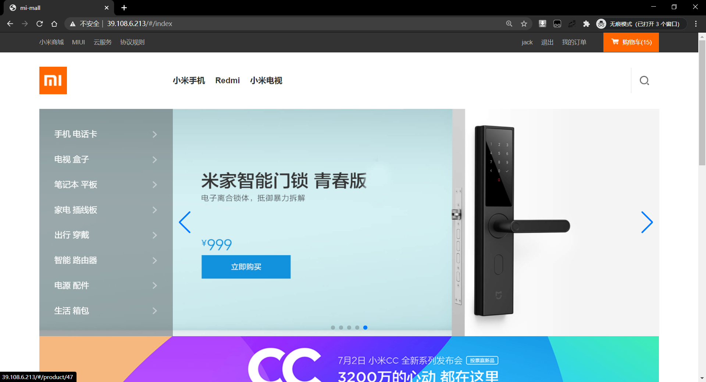
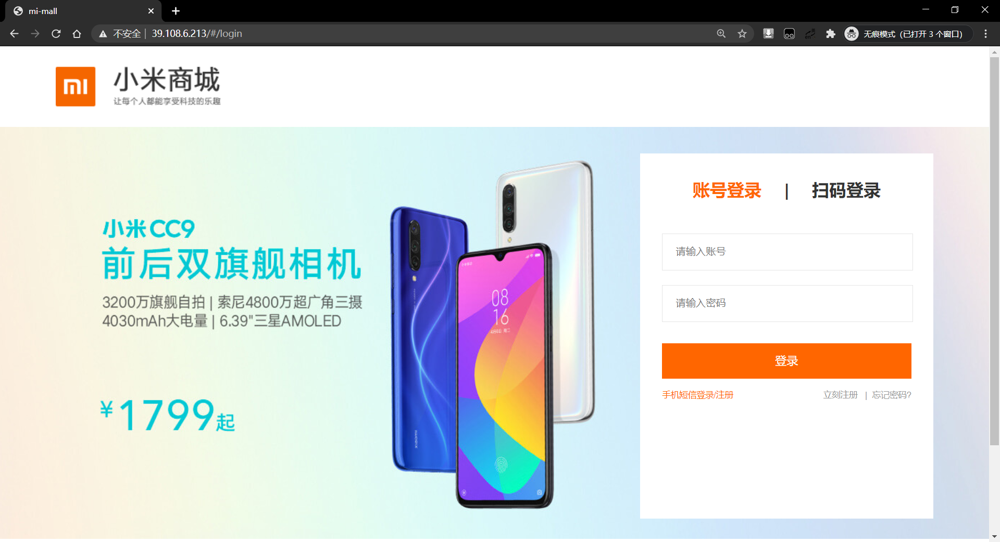
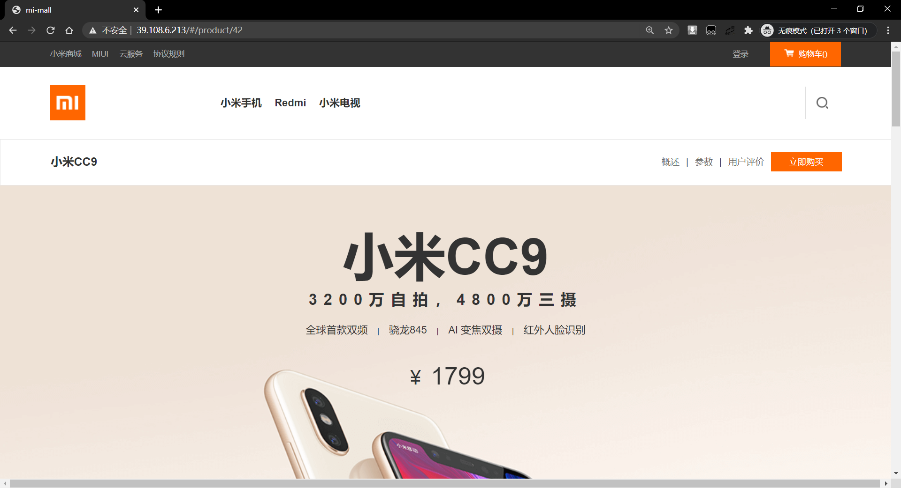
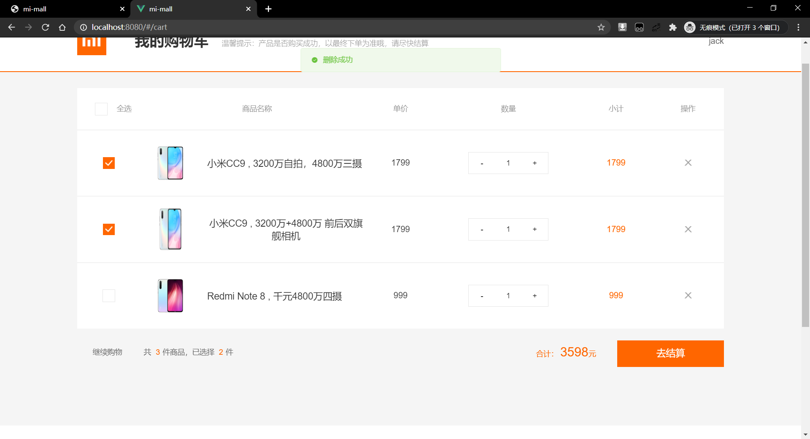
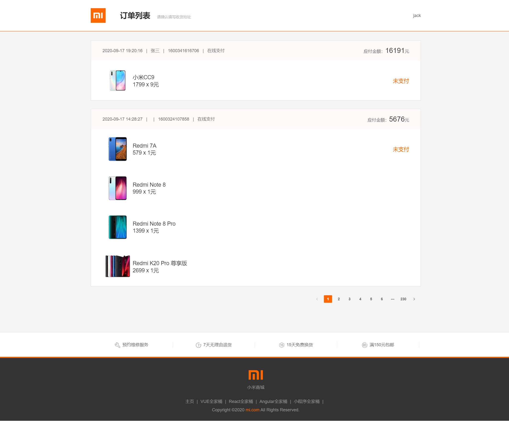

#  mi-mall

    

## 项目简介

一直知道 Vue 是前端必会的框架, 但是之前就只匆匆了解了一下基本的语法, 因为微信小程序在移动端相对Vue 来说对我的吸引力更大, 所以学着学着就有了 49年入国军内味, 嘞个恨呐, 所以暑假回学校后赶紧找了一个项目来上手 Vue 全家桶 -->  小米商城

这个项目是基于 Vue 2.6、Vue-cli && Vue-router && Vuex 4.5.4 为主线，辅以

ElementUI: 甭说，Vue 框架中火出天际的样式库

vue-lazyload: 图片懒加载减少两端带宽压力

vue-axios/axios: Promise 式发送异步请求网络资源，贼爽

vue-awesome-swiper: 封装的轮播组件库，功能丰富齐全，轮播就它了

vue-cookie：对原生浏览器操作 Cookie 的 api 进行封装的库

项目运用了大量 Vue 中常用的知识点，Vue基本指令、组件、计算属性、数据渲染、生命周期钩子、slot插槽等等。

## 项目已完成功能

* 登录页
* 商城首页
* 商城产品站
* 商城详情
* 购物车
* 订单确认
* 订单列表

## 项目运行截图

